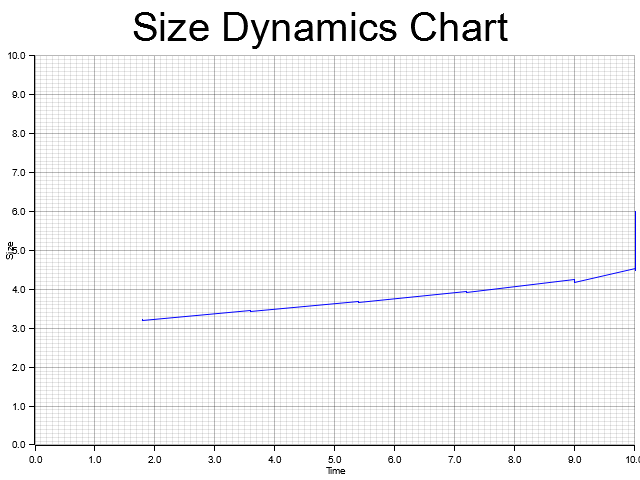

# rust-eco-ib

rust-eco-lib (Rust library for E. coli size dynamics estimation) is library to estimate bacterial cell size stochastic dynamics including time-continuous growth process and division events.

This simulator is based on PyEcoLib project:

Read [the article](https://www.biorxiv.org/content/10.1101/2020.09.29.319152v1.full.pdf+html) presenting the library.
Read [the article](https://www.biorxiv.org/content/10.1101/2020.09.29.319251v1) with the theory behind the simulator.

Some of the basic uses PyEcoLyb:
* Estimating stochastic division times of E. coli bacteria with arbitrary precision from measurable parameters like growth rate, mean cell size and number of division steps. These times can be coupled to any stochastic simulation algorithm for gene expression.
* Estimating numerically the dynamics of the mean and the coefficient of variance of the size-distribution for continuously growing and dividing bacteria.
* Computing the trends in added size versus the size at division for different division strategies (Adder, timer-like, sizer-like) depending on the parameter . 
* Including variability in the septal position during cell splitting. This can be used to model the molecule segregation.
* Set an arbitrary distribution of initial sizes.
* Set variability in cell-to-cell growth rate.

Limitations:
* For this version of the simulator still not have compatibility with division strategies and the lambda value is 1.0 for defect.